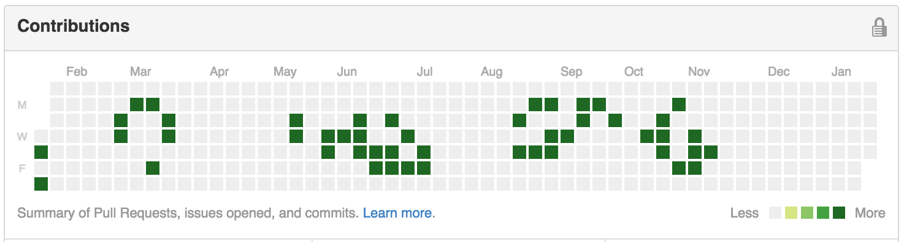

# ghub-game-of-life
A javascript bookmarklet that turns Github's contributions calendar into a cellular automata (Game of Life).

## Usage

Drag this **[this bookmarklet](https://cdn.rawgit.com/giuliandrimba/ghub-game-of-life/r2/bookmarklet.html)** to your bookmarks bar and let's shake your commit activity!

